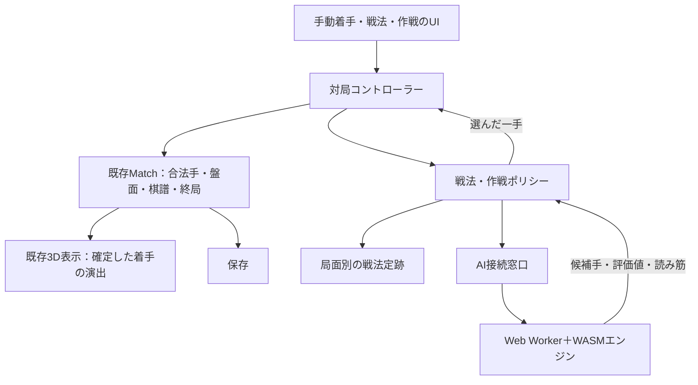

# 将棋AI・戦法選択・対局中の作戦指示 設計方針

作成日：2026-09-05

更新日：2026-09-06

状態：AI、先後独立の起動・停止、戦法・作戦、演出と独立した連続着手を実装。採用版・設定値・検証範囲は [AI実装記録](ai-implementation.md) を参照。兵種別の新しい戦闘モーションは別設計であり、この実装完了には含めない。

## 1. 目的と採用方針

既存の3D将棋に、戦法と指し方の方針を指定できるAIを組み込む。対局前に戦法を選び、対局中は「攻勢・守備・反撃狙い・おまかせ」を切り替える。盤面を維持したまま、以降のAIの意思決定へ反映する。

強さの段階調整よりも、戦法と作戦による指し方の違いを優先する。将棋のルール、手番、持ち駒、成り、千日手を維持し、地形・部隊人数・ドラゴンの飛行などの3D表現はAIの合法手や評価に影響させない。

初期構成はブラウザ内のWeb Worker＋WebAssemblyエンジン。AIへの接続窓口を分離し、将来はサーバー側のエンジンへ差し替えられるようにする。

### 合意事項と設計上の初期値

| 区分 | 内容 |
| --- | --- |
| 合意した方針 | AIの導入、戦法指定、対局途中の方針変更、その方針を文書化する |
| 実装UI | 先手・後手それぞれにAI開始／停止、戦法、作戦を常設。対局途中から変更できる |
| 担当の指定 | 2026-09-06の依頼により、先後どちらも任意の時点でAIへ委任。両方手動・片側AI・両側AIを同じ対局内で切り替える |
| 将来の拡張候補 | 指定戦型からの練習、棋力設定、兵種別の新しい戦闘モーション |
| 採用版 | やねうら王7.63のWASM移植と内蔵SuishoPetite20211123。配布元リビジョンを固定し、独自の序盤分岐を同梱 |
| 未決定 | アプリ全体の公開配布条件の最終確認、投げ銭サービス |

初期状態と旧保存の復元は両方手動。プレイヤーが陣営の「AI開始」を押した場合だけ、その陣営の着手をAIへ委任する。停止すれば現在の局面から手動へ戻る。

## 2. プレイヤーが指定する内容

### 戦法：序盤に目指す形

初期候補は「おまかせ・居飛車・四間飛車・中飛車」。戦法ごとに、先手・後手と相手の応手に対応した定跡を用意する。固定の手順を機械的に再生せず、局面をキーに合法な分岐を選ぶ。

相手の応手によっては希望の形に進めない。「四間飛車を指定すると必ずその形になる」とは表示しない。定跡がない局面では通常探索へ移り、実装済みの戦法判定・移行条件の範囲で希望を考慮する。

### 作戦：現在の局面で優先するもの

| 作戦 | 候補手を比較する観点 | 避ける実装 |
| --- | --- | --- |
| おまかせ | エンジンの評価を優先 | 不必要な独自補正 |
| 攻勢 | 攻撃駒の働き、相手玉周辺への圧力、主導権 | 王手や駒取りだけを機械的に選ぶ |
| 守備 | 自玉の安全、守備駒の連携、相手の脅威の軽減 | 玉の周りに駒を集めるだけの手 |
| 反撃狙い | 脅威への対応と、次の攻撃につながる駒の配置 | 単なる待機や無意味な往復 |

これらはアプリ側で追加する選択方針であり、エンジンの既製設定がそのまま全てを実現するわけではない。最初は説明できる少数の局面特徴から実装し、検証用局面と対局で調整する。

### 対局途中の変更

- 作戦変更は次の未確定の着手から有効。盤面と確定済みの棋譜は変えない。
- 思考中なら、その依頼を無効化して停止し、同じ局面を新しい指示で探索し直す。
- 移動演出中の着手は確定済みであり取り消さない。並行して次の思考が進んでいれば、その未確定の依頼へ新しい指示を反映する。
- 戦法の途中変更も設定として受け付けるが、序盤の定跡を現在局面に無理に当てはめない。移行に数手必要な場合や、安全に移行できない場合がある。
- 戦法変更時は旧戦法の定跡参照と移行計画を破棄し、現在局面から再判定する。移行を扱えない局面では「この局面では作戦指示を優先」と表示する。
- 指示変更を連打しても探索を並列に増やさない。最後に選んだ指示のみを採用する。

## 3. 全体構成



| 担当 | 責務 |
| --- | --- |
| `dist/rules.mjs`・`dist/match.mjs`（既存） | 人間・AI両方の着手を検証し、対局状態を確定する唯一の入口 |
| `dist/app.js`（既存） | 入力と表示。直接行っている手番制御を対局コントローラーへ段階的に移す |
| `dist/game-controller.mjs`（実装） | 手番、操作可能状態、思考依頼、キャンセル、演出完了、終局の管理 |
| `dist/ai/engine-client.mjs`（実装） | 非同期の初期化・探索・停止・終了。Workerや将来の通信先を隠蔽 |
| `dist/ai/engine-worker.js`（実装） | エンジン起動、USI通信、探索結果の整形。盤面やDOMを直接変更しない |
| `dist/ai/usi-codec.mjs`（実装） | 内部座標とUSI着手、SFEN、持ち駒、成り、手順履歴の相互変換 |
| `dist/ai/strategy-policy.mjs`（実装） | 戦法定跡の選択、作戦に沿った候補手の比較、移行状態の管理 |
| `dist/ai/openings/`（実装） | 配布可能な戦法定跡と出典情報 |
| `dist/battlefield.js`等（既存） | 確定した着手の3D演出。AIの判断を行わない |

React・DB・対局サーバーへの移行は、この機能の前提にしない。既存の同一端末2人対局も維持する。

## 4. 候補手の選び方

1. 局面・手番・履歴・現在の指示をスナップショットとして取得する。
2. 初期局面または対応する分岐がある場合、指定戦法の定跡候補を取得する。
3. エンジンから複数候補と評価値を取得する。定跡候補がある場合も、必要な安全確認を行う。
4. 内部の合法手と照合し、詰み評価・評価の上下限・探索の完了状態を整理する。
5. 十分に比較できる候補の中から、最良評価との差が許容範囲にあるものを残す。
6. その範囲内で作戦と戦法の継続性を考慮し、一手を選ぶ。「おまかせ」は最良評価を基本とする。
7. 対局コントローラーが依頼の有効性を再確認し、`Match.play()`で検証・確定する。

評価値は常にAI側にとって良いほど大きい向きへ統一する。詰みを示す値を通常の駒得評価へ混ぜない。異なる探索深さの結果や上限・下限だけの値を同じ確度として扱わない。

王手中は自玉の安全を優先する。探索で検出した即詰みや重大な損失を、作戦の都合で選ばない。ただし有限の探索で全ての危険を保証できるわけではない。

許容する評価差、候補数、特徴量の重みは検証後に決める。固定の評価差を「何級相当」や普遍的な安全基準として扱わない。上位候補に希望の戦法の手が現れない場合もあるため、MultiPVだけで戦法を保証しない。候補を限定した追加探索などは採用エンジンの対応を確認して導入する。

戦法への移行は一手ごとの好みだけで決めず、「移行を試みる・継続・中断」を記録する。局面の変化に応じて再評価し、同じ駒の無意味な往復を抑える。

## 5. 非同期処理と古い回答の排除

対局状態は `loading / human-turn / ai-thinking / ended / error` を基本とし、移動・戦闘の再生状態は独立して管理する。2026-09-06の合意により、演出終了後にAI思考を始める旧方針を変更する。着手の確定直後に次の手番へ進み、AIなら最新の確定局面から思考を始める。先手・後手のAIが指し続ける間も複数の移動・戦闘を並行再生し、演出の完了を次の思考・着手の条件にしない。これは表示との非同期化であり、未確定の手に対する先読みではない。競合時の短縮・取り返し・持ち駒の即時反映は[駒取り・部隊戦闘アニメーションの設計方針](capture-animation-design.md)に従う。

探索依頼は次の情報を持つ。

```text
SearchRequest
  gameId                 対局を作り直すたびに更新
  positionRevision       着手・戻す・復元などで単調増加（手数を流用しない）
  policyRevision         指示変更ごとに増加
  requestId              思考依頼ごとに一意
  side                   AIの陣営
  startPosition + moves  開始局面と全手順。千日手判定に必要な履歴を保持
  opening / order        戦法と作戦
  limits                 探索量・時間・メモリ等の上限
```

回答に同じ識別情報を付け、全てが現在値と一致し、AIの手番で、終局していない場合だけ採用する。`bestmove`以外に、候補手・評価種別・評価値・探索深さ・読み筋を必要に応じて返す。

USIの応答自体にはアプリ独自のrequestIdがない。Worker内では探索を直列化し、`stop`後の旧`bestmove`を回収・破棄してから新しい探索を開始する。旧応答を新しい依頼の結果として付け替えない。停止に応答しない場合は期限付きでWorkerを終了・再生成する。

「一手戻す」、リセット、復元、モード変更、終局でも依頼を無効化する。人間対CPUの戻す操作は、原則として直前の人間の判断位置まで戻す。AI思考中なら人間の直前の一手、AIが指し終えた後なら原則二手を戻す。先後や履歴の長さを考慮し、AIの手番へ戻して即座に同じ手を指し直す挙動を避ける。2人対局では既存の一手戻すを維持する。

## 6. エンジン・性能・失敗時の扱い

やねうら王系のWebAssembly版を第一候補とする。版・ビルド・データを固定し、USIの初期応答から利用可能なオプションを確認する。MultiPV、探索量制限、停止処理、必要メモリを実機で確かめる。

- CPU対局を選択した時点で必要素材を遅延読込し、初期化完了までAI対局を開始しない。
- 初期値は1探索スレッドを基本案とし、エンジンが対応する場合に採用する。候補数はまず3〜5手、思考時間上限は通常1〜3秒を試験値とする。保証値ではなく、対象端末で調整する。
- 探索量を基本予算、時間を応答期限として併用する。端末性能による棋力差は完全には解消しない。
- Workerは画面と別スレッドだがCPU・メモリは端末全体で共有する。3D描画と同時に測定する。
- WASMのビルドによってSharedArrayBufferやクロスオリジン分離が必要になる。採用版と配信環境を確認し、対応ヘッダーや外部リソースへの影響を検証する。
- ロード失敗、異常終了、不正着手、思考期限超過は状態を確定せず、再試行または人間操作への切替を提示する。無断でランダムな手を指さない。
- AIの投了応答は、通常の着手と分けて扱う。投了として終局できる対局管理を追加する。宣言勝ちは既存の対応ルールに合わせ、未対応の宣言をそのまま勝利として受理しない。

## 7. UIと保存

先手・後手それぞれの操作欄に「AI開始／AI停止」「戦法」「作戦」を表示する。現在の局面を維持して担当を切り替え、相手側を先に有効にした場合はその手番を待つ。両側の停止ボタンも設ける。棋力の細かな段階設定は後続とする。

対局中はCPU陣営名、戦法、現在の作戦、思考中表示をまとめ、作戦の4択を常時変更できるようにする。変更時には「守備を重視して考え直しています」「次の思考から適用」のように実際の適用時点を表示する。技術用語や評価値を通常の指示UIへ出さない。

既存の盤面・棋譜に加えて、保存形式の版、対局モード、担当陣営、現在の戦法・作戦、指示変更履歴を保存する。指示履歴は着手履歴と分け、適用手番・連番・旧値・新値を持つ。思考中のWorkerやrequestIdは復元せず、復元後に新規依頼を作る。

旧保存データは2人対局として読み込めるようにする。戻す操作では、その判断位置より後の指示変更履歴も戻し、対局と指示の状態を一致させる。

## 8. 無料公開・投げ銭とライセンス

任意の投げ銭を設置する構想を考慮するが、この設計では決済機能を実装しない。やねうら王のGPLv3は有償配布も認める。収益の有無とは別に、配布物と組み込み方法に応じた条件を満たす。

- エンジン本体、WASM移植部分、学習済みデータ、定跡のライセンスをそれぞれ確認する。
- ブラウザへ配布する実行物には、対応するソースコード、必要なビルド手順、著作権・ライセンス表示などの提供方法を用意する。
- Web Workerやファイルの分離だけでゲーム側へのGPL適用を回避できるとは判断しない。
- ゲームコードの公開範囲は未決定。非公開を希望する場合は、独立したサーバー側エンジンなどの構成も含めて、配布前に適用範囲を確認する。
- 非商用限定データを「投げ銭だから問題ない」と扱わず、想定する利用と再配布に適合するデータを採用する。

本項は技術選定上の確認事項であり、アプリ全体のライセンス適合を確定するものではない。

## 9. 実装順序と完了条件

| 段階 | 実装 | 完了条件 |
| --- | --- | --- |
| 1 | エンジン・データの選定、変換処理、Worker接続 | ライセンス・必要ヘッダーを確認し、先後・持ち駒・成り・履歴を正しく渡して着手を受信できる |
| 2 | 対局コントローラーとCPU対局 | 人間とAIが同じMatchを通して対局し、終局・保存復元・戻す・失敗復旧が動く |
| 3 | 戦法別定跡 | 四間飛車・中飛車などの分岐、定跡逸脱時の探索への切替を確認できる |
| 4 | 作戦ポリシー | 検証用局面で、同じ探索予算でも作戦による選択の違いを確認できる |
| 5 | 対局中の指示変更 | 思考中・演出中・戻す・連続変更で古い回答が採用されず、現在の指示だけが有効になる |
| 6 | 戦法移行・負荷・配布準備 | 無理な移行や往復を抑え、3D描画との同時性能、配布するソースと表示を確認する |

重点テストは、座標と成り・持ち駒の変換、千日手に必要な履歴、旧保存との互換性、AI着手の合法性、停止後の遅延応答、方針変更の連打、終局直前の応答、AI投了、読み込み失敗とする。

作戦の品質は単体テストだけで判断しない。攻め・守り・反撃の代表局面と、相手が定跡を外す対局を用意し、合法性、致命的な損失、作戦らしさ、応答時間を確認する。性能はPCと実機スマホで測定し、画面幅のエミュレーションだけで実機確認済みとしない。

## 10. 参照

- [既存の制作方針](product-vision.md)
- [やねうら王公式：USI・MultiPV・定跡](https://github.com/yaneurao/YaneuraOu)
- [やねうら王GPLv3](https://github.com/yaneurao/YaneuraOu/blob/master/LICENSE)
- [採用したWASM移植：固定リビジョン](https://github.com/usumerican/yaneuraou-suisho-petite/tree/4568f76268128a65c5936d15a2188c8f64f71847)
- [MDN：Web Workers](https://developer.mozilla.org/en-US/docs/Web/API/Web_Workers_API/Using_web_workers)
- [MDN：crossOriginIsolated](https://developer.mozilla.org/en-US/docs/Web/API/WorkerGlobalScope/crossOriginIsolated)
