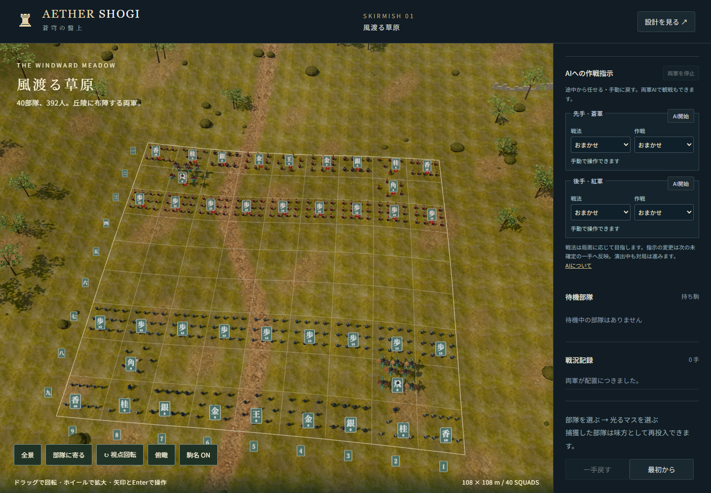
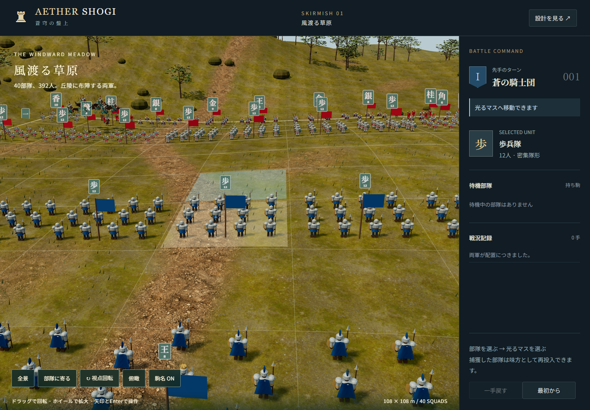
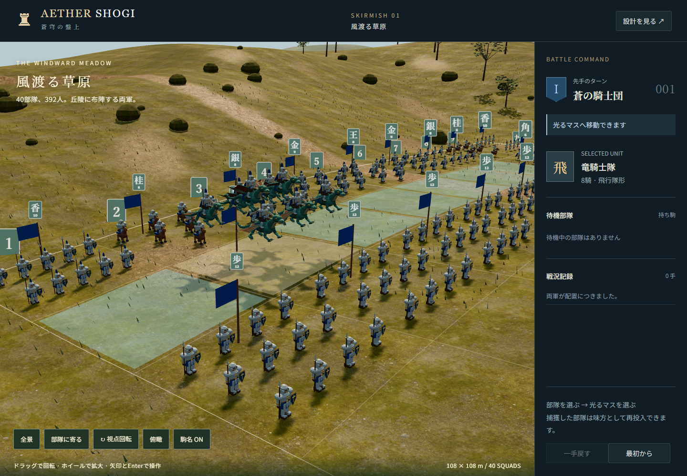
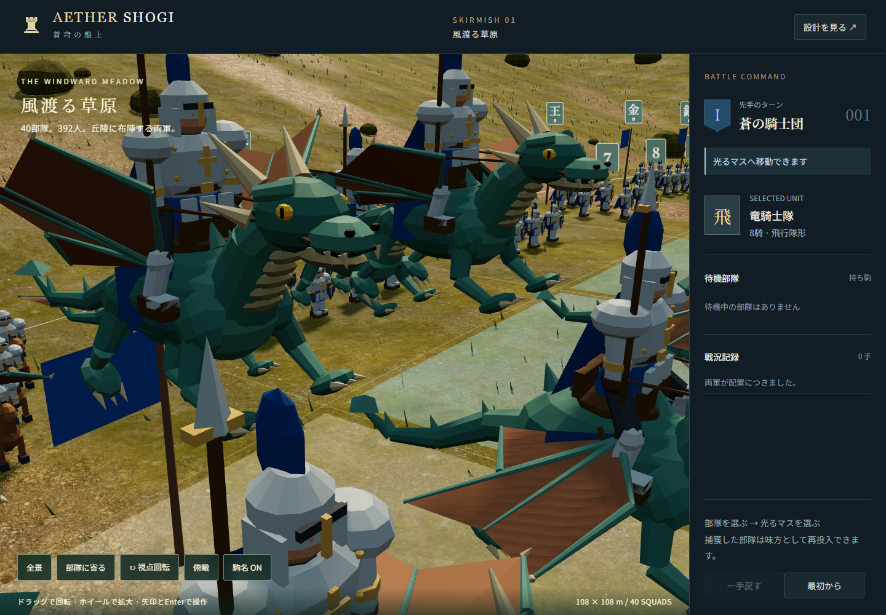

# 実装・検証記録

更新日：2026-09-06

一駒を6〜12人の部隊に変更し、108m四方の対局範囲と480m四方の周辺地形を実装した。仕様と完了条件は [部隊化・広域フィールド](squad-scale.md)、モデル編集は [Blender編集手順](../assets/blender/README.md) を参照。

## 実装結果

- 初期40部隊・392人。歩兵密集隊形、騎兵楔形、指揮官・魔導士の護衛陣形など8兵種。
- Blender製の丘陵、枝葉の木、岩、草、石積み。地面と岩にCC0の実写素材を使用。
- 地上兵の接地、飛車16騎の浮遊、地面に沿う細い区切り線、移動先表示、隊列移動・再整列・捕獲・再投入・昇格。
- 全景と選択部隊への接近、回転、俯瞰、駒名表示。札・旗とマスから部隊を選択。
- インスタンス描画、遠景用モデル、接近時の装備・部位アニメーション。スマホ幅では240人表示。
- 将棋ルール・保存形式は維持し、以前の保存データから復元可能。

## 検証

Windows、Node.js 22、Blender 5.2.1 LTS、ローカルのChromeを使用。

| コマンド | 結果・範囲 |
| --- | --- |
| `npm test` | 7件成功。合法手、捕獲、成り、持ち駒、打ち歩詰め、80手の不変条件、保存復元、一手戻す、千日手、81マス、地面の三角形補間、隊形の間隔とマス内への収まり、392人と240人の人数 |
| `npm run build` | GLB構造、原型とLODの全8兵種、地面の高さ、編集元、同梱9枚のJPEG、CC0出典、容量上限を検証 |
| `npm run test:web` | 5件成功。以下の実ブラウザ操作を検証 |
| Blender再生成 | 地形・兵士原型・LOD・GLB・編集元の書き出し成功 |
| Blender再書き出し | 保存済みの編集元から、原型を保持しLODを更新してGLBを書き出し成功 |

ブラウザではクリック、キー操作、タッチ、一手戻す、保存復元、捕獲、持ち駒投入、成りの選択と復元、視点・札切替、全景・接近のLOD変更、接近中の旗選択と移動、横はみ出し、GLB読込失敗時の再試行表示を確認。JavaScript例外とシェーダーを含むコンソールエラーがないこと、地上376人の足元が地面に沿い、ドラゴン16騎が浮遊することも検証した。

飛車の追加検証では、8騎の構成、空中のドラゴン本体からの選択、空中での待機・移動、竜王への成り、保存復元、一手戻す、動きを減らす設定での空中静止を確認した。原型・遠景モデルの両方で翼・尾・成りの部位が揃い、ドラゴン全体が各マスに収まることも検証する。

## 描画計測

WindowsのヘッドレスChromeで各90フレームを採取した参考値。1440×1000のPC画面と、390×844・タッチ有効・端末倍率2のエミュレーションを使用する。実機スマホのGPU性能を示す値ではない。

| 表示 | 人数 | 詳細表示の部隊 | 描画呼出 | 三角形 | 平均フレーム間隔 | 95%点 |
| --- | ---: | ---: | ---: | ---: | ---: | ---: |
| PC全景 | 392 | 0 | 186 | 554,891 | 13.28ms | 13.4ms |
| PC接近 | 392 | 24 | 168 | 837,929 | 13.22ms | 13.4ms |
| スマホ幅・全景 | 240 | 0 | 190 | 474,135 | 13.22ms | 13.5ms |

計測ファイル： [全景](verification/desktop-performance.json)、[接近](verification/close-performance.json)、[スマホ幅](verification/mobile-performance.json)。実行条件によって値は変わる。自動テストはPC110万三角形、スマホ全景60万三角形、500描画呼出を上限として確認する。

地形GLBは21,379,948 bytes、兵士GLBは2,075,764 bytes、テクスチャ9枚は7,057,732 bytes。初回アート素材は合計約29.10MiB。動作時はこれらのローカルファイルを使い、BlenderやMCPへの接続は不要。

## 画面

全景：

接近：

[スマホ縦画面](verification/mobile.png)、[選択状態](verification/desktop-selected.png)、[成りの復元](verification/promotion.png) も保存した。

飛車の飛行隊：

[成り後](verification/dragon-promoted.png)、[飛行隊の描画計測](verification/dragon-performance.json)。

## 検証の範囲と公開状態

実機スマホ・Safariの性能と2本指ジェスチャーの実機確認は未実施。兵士は既存の様式のモデルを使い、骨格リグやモーションキャプチャは導入していない。CPU、オンライン対局、時計、持将棋、入玉宣言は今回の対象外。

ローカル起動は `npm run dev`。この変更だけでは既存のSites公開デモは更新されない。

## 2026-09-06：ズーム範囲の拡張

最短距離を42mから8mへ変更。ホイールを距離に比例した操作量にし、接近時は対象の高さへ注視点を補正する。地表から最低0.8mのカメラ高を保つ。「部隊に寄る」の48mと「全景」の185mは従来通り。

Chromeで8mまでのホイール拡大、小幅の縮小、飛行部隊への注視、地面との距離、全景への復帰を確認。スマホ画面のエミュレーションでは2点タッチを送信し、ピンチ拡大で8mに達して全景に戻れることを確認した。既存のPC操作・竜騎士操作のブラウザテスト2件も成功。

