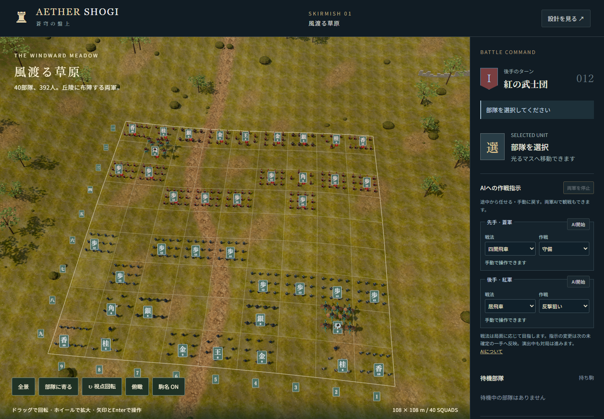
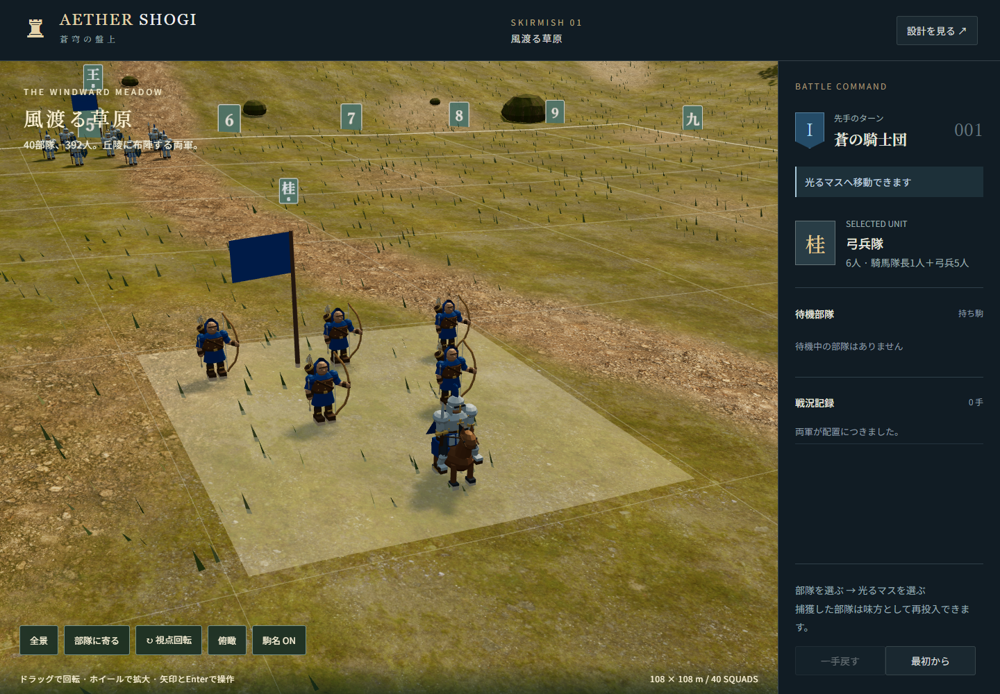
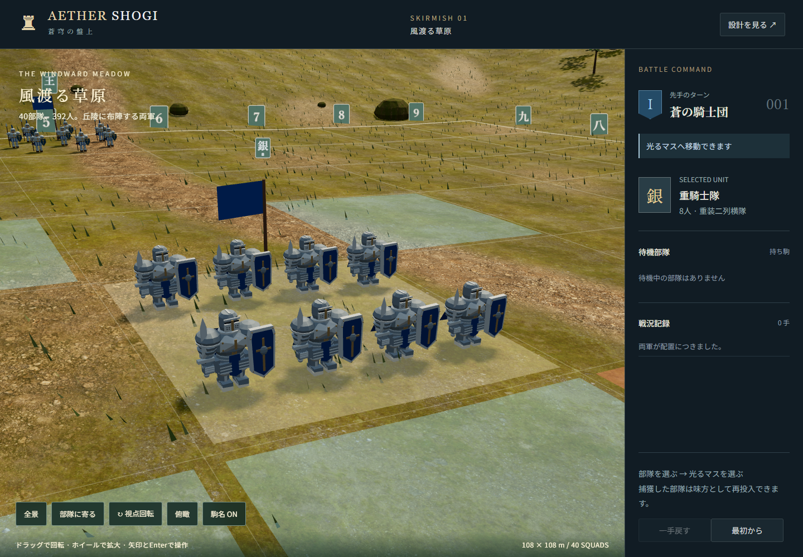
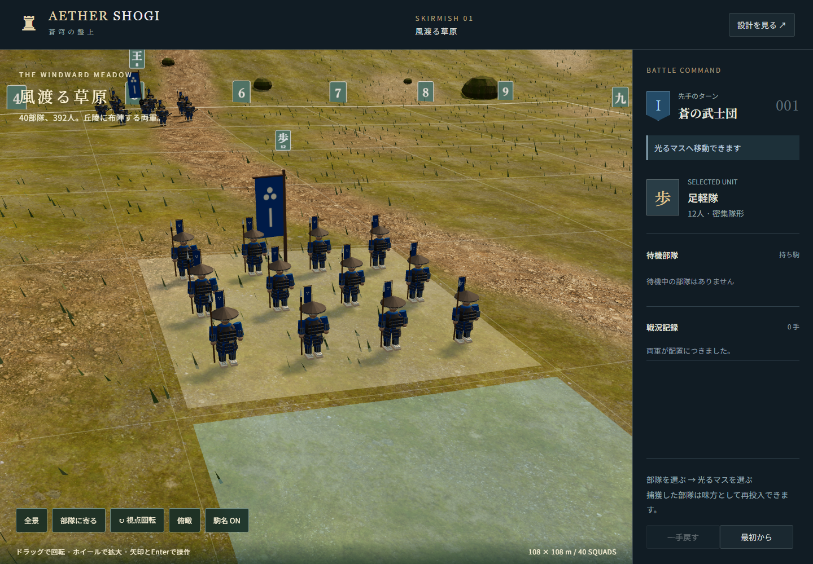

# 実装・検証記録

更新日：2026-09-06

一駒を6〜12人の部隊に変更し、108m四方の対局範囲と480m四方の周辺地形を実装した。仕様と完了条件は [部隊化・広域フィールド](squad-scale.md)、モデル編集は [Blender編集手順](../assets/blender/README.md) を参照。

## 実装結果

- 初期40部隊・392人。足軽の密集隊形、騎馬武者と弓足軽の楔形、大将・陰陽師の護衛陣形など8兵種。
- Blender製の丘陵、枝葉の木、岩、草、石積み。地面と岩にCC0の実写素材を使用。
- 地上兵の接地、飛車16騎の浮遊、地面に沿う細い区切り線、移動先表示、隊列移動・再整列・捕獲・再投入・昇格。
- 全景と選択部隊への接近、回転、俯瞰、駒名表示。札・旗とマスから部隊を選択。
- インスタンス描画、遠景用モデル、接近時の装備・部位アニメーション。スマホ幅では240人表示。
- 将棋ルール・保存形式は維持し、以前の保存データから復元可能。
- 先後それぞれのAI開始・停止、戦法・作戦の変更、AI同士の観戦。やねうら王のWASMを同梱し、確定局面から演出と独立して次の思考を始める。

## 検証

Windows、Node.js 22、Blender 5.2.1 LTS、ローカルのChromeを使用。

| コマンド | 結果・範囲 |
| --- | --- |
| `npm test` | 25件成功。既存ルール・保存・地形・隊形に加え、AIのUSI/SFEN・全履歴、依頼の取消、連続指示、先後の担当、非同期演出、復元・戻す・投了、定跡・候補比較、期限超過を検証 |
| `npm run build` | GLB構造、全10原型とLOD、地面の高さ、編集元、同梱9枚のJPEG、CC0出典、容量上限、AI配布物の容量とSHA-256・WASM構造・対応ソースを検証 |
| `npm run test:web` | 16件成功。既存9件、実物WASMのAI対局・停止・指示・保存・異常復旧・詰み・スマホ操作・静的配信6件、演出中の取り返し・即時投入・巻き戻し等1件を検証 |
| Blender再生成 | 地形・兵士原型・LOD・GLB・編集元の書き出し成功 |
| Blender再書き出し | 保存済みの編集元から、原型を保持しLODを更新してGLBを書き出し成功 |

ブラウザではクリック、キー操作、タッチ、一手戻す、保存復元、捕獲、持ち駒投入、成りの選択と復元、視点・札切替、全景・接近のLOD変更、接近中の旗選択と移動、横はみ出し、GLB読込失敗時の再試行表示を確認。JavaScript例外とシェーダーを含むコンソールエラーがないこと、地上376人の足元が地面に沿い、ドラゴン16騎が浮遊することも検証した。

飛車の追加検証では、8騎の構成、空中のドラゴン本体からの選択、空中での待機・移動、竜王への成り、保存復元、一手戻す、動きを減らす設定での空中静止を確認した。原型・遠景モデルの両方で翼・尾・成りの部位が揃い、ドラゴン全体が各マスに収まることも検証する。

## 描画計測

WindowsのヘッドレスChromeで各90フレームを採取した参考値。1440×1000のPC画面と、390×844・タッチ有効・端末倍率2のエミュレーションを使用する。実機スマホのGPU性能を示す値ではない。

| 表示 | 人数 | 詳細表示の部隊 | 描画呼出 | 三角形 | 平均フレーム間隔 | 95%点 |
| --- | ---: | ---: | ---: | ---: | ---: | ---: |
| PC全景 | 392 | 0 | 230 | 597,047 | 13.20ms | 13.40ms |
| PC接近 | 392 | 24 | 197 | 929,946 | 13.24ms | 13.38ms |
| スマホ幅・全景 | 240 | 0 | 234 | 505,819 | 13.27ms | 13.42ms |

計測ファイル： [全景](verification/desktop-performance.json)、[接近](verification/close-performance.json)、[スマホ幅](verification/mobile-performance.json)。実行条件によって値は変わる。自動テストはPC110万三角形、スマホ全景60万三角形、500描画呼出を上限として確認する。

地形GLBは21,379,948 bytes、兵士GLBは3,076,392 bytes、テクスチャ9枚は7,057,732 bytes。初回アート素材は合計約30.05MiB。動作時はこれらのローカルファイルを使い、BlenderやMCPへの接続は不要。

## 画面

全景：

接近：

[スマホ縦画面](verification/mobile.png)、[選択状態](verification/desktop-selected.png)、[成りの復元](verification/promotion.png) も保存した。

飛車の飛行隊：

[成り後](verification/dragon-promoted.png)、[飛行隊の描画計測](verification/dragon-performance.json)。

## 検証の範囲と公開状態

実機スマホ・Safariの性能と2本指ジェスチャーの実機確認は未実施。兵士は戦国風のオリジナルモデルを使い、骨格リグやモーションキャプチャは導入していない。オンライン対局、時計、持将棋、入玉宣言は今回の対象外。AIの多数対局による棋力・作戦品質の統計的評価も未実施。

ローカル起動は `npm run dev`。この変更だけでは既存のSites公開デモは更新されない。

## 2026-09-06：先後それぞれのAIと作戦指示

先手・後手のどちらも、任意の局面でAIへ任せて停止できるようにした。両軍AIでの観戦、戦法4種類・作戦4種類、指示の連続変更、保存復元、判断位置への巻き戻しに対応する。やねうら王7.63と内蔵SuishoPetiteのWASMを遅延読込し、全手順を含む局面を別スレッドで探索する。古い回答・不正着手を採用せず、失敗時には再試行と手動への復帰を表示する。

着手確定後は移動の完了を待たずに次の思考・手動操作へ進む。部隊の並行移動、同一部隊の再移動、取り返し、取った駒の即時投入、演出中の戻す・リセットを確認した。後手の歩の回転修正も維持する。今回追加したのは非同期制御の基礎であり、兵種別の新しい戦闘モーション・掛け声は別途実装する。

実物WASMを使う対局と3D描画の同時計測では392人、234描画呼出、598,199三角形を維持した。フレーム間隔は実行条件で変わるため、最新値は [AI計測](verification/ai-performance.json) を参照。スマホ操作は画面幅・タッチのエミュレーションで確認した。

AIの対応ソース、ライセンス表示、配布ファイルの固定版とハッシュを同梱した。既存の5173番ローカルサーバーも必要なヘッダーを付ける版へ再起動済み。ヘッダーのない静的サーバーでは初回準備による一度の再読み込みと局面の維持を検証した。

操作方法・具体的な探索設定・制約は [AI実装記録](ai-implementation.md) を参照。

[スマホのAI操作](verification/ai-mobile.png)。

## 2026-09-06：ズーム範囲の拡張

最短距離を42mから8mへ変更。ホイールを距離に比例した操作量にし、接近時は対象の高さへ注視点を補正する。地表から最低0.8mのカメラ高を保つ。「部隊に寄る」の48mと「全景」の185mは従来通り。

Chromeで8mまでのホイール拡大、小幅の縮小、飛行部隊への注視、地面との距離、全景への復帰を確認。スマホ画面のエミュレーションでは2点タッチを送信し、ピンチ拡大で8mに達して全景に戻れることを確認した。既存のPC操作・竜騎士操作のブラウザテスト2件も成功。

## 2026-09-06：マスを広く使う兵士配置

歩兵の中心点間の幅を4.95mから8.1m、奥行きを3.7mから6.8mへ拡大。長槍、騎兵、剣士、近衛、魔導士と本陣の護衛も、兵種ごとの隊形を保ちながら広げた。スマホの6人表示は配置順の両端を含むように変更した。後列中央にも兵士がいる騎兵・近衛は旗を横へずらし、兵士と旗竿が重ならないようにした。

既存の7件のテスト、アセット検証、5件のブラウザテストが成功。追加の確認で、全8兵種について詳細モデル・遠景モデル・PC配置・スマホ配置の実際のGLB境界を調べ、武器と装備を含む静止時の配置が12mのマス内に収まることを確認した。上記の全景・接近・スマホの画面と計測を更新した。

## 2026-09-06：桂馬を騎馬隊長と弓兵で構成

桂馬一部隊を、先頭の騎馬隊長1人と2・3人の二段に並ぶ弓兵5人へ変更。マス内の幅7.6m・奥行7.0mと合計6人を維持する。隊長に羽飾り・マント・馬具を加え、弓兵はフード・軽装・弓・弦・矢筒・矢を備えた専用モデルにした。遠景でも弓の曲線と弦・矢が消えないようにLODを調整した。選択時は「弓兵隊」「6人 · 騎馬隊長1人＋弓兵5人」と表示する。

Blender編集元とGLBを更新し、他の兵種・地形・LODのメッシュが変更されていないことを確認。既存7件のテスト、GLB・容量・装備込みの境界検証、ブラウザ5件が成功した。PC・スマホの初期表示は騎馬隊長4人と弓兵20人を含み、総人数392人・省略時240人を維持する。

桂馬の追加確認では、約22mまで拡大して1人＋5人の見え方・接地・詳細モデルを確認した。桂馬の跳躍移動による捕獲、成り、保存復元、一手戻すの後も同じ構成を維持し、JavaScript・コンソールエラーがないことを確認した。[成り後の画面](verification/knight-promoted.png)と[確認用局面の描画情報](verification/knight-performance.json)を保存した。

## 2026-09-06：銀の重騎士隊

銀を8人の重騎士へ変更し、4列×2段の広い配置を維持した。厚い胸甲、大型の重ね肩鎧、閉鎖型の兜、腰鎧、籠手、膝と脛の装甲、大盾、幅広の剣、陣営色のマントを備える。装備込みの横幅は通常歩兵の約1.7倍。成ると兜と肩に金の装飾を追加する。

銀専用の`Unit_H`と`LOD_H`を追加し、角の護衛の剣士を含む既存の原型・LOD・地形メッシュが変化していないことをBlenderで確認した。装備を含む境界検証でも、詳細・遠景・PC・スマホの配置が12mのマス内に収まる。銀の移動、捕獲、成り、保存復元、一手戻すと8人の構成、接地、コンソールエラーがないことを追加確認した。

既存7件のテストとブラウザ5件、GLBの構造・容量検証が成功。初期配置の銀4部隊はPCで32人、スマホの省略表示で24人の重騎士として描画され、角の護衛10人は元の剣士を維持する。上記の画面と描画計測も更新した。

[成り後の重騎士](verification/silver-promoted.png)。

## 2026-09-06：カーソルを基準にした拡大縮小

ホイールの基準を選択中の部隊からカーソル直下の地面・兵士・ドラゴンへ変更した。拡大・縮小の前後でその座標が同じ画面位置に残るよう、カメラと注視点を一緒に移動する。縮小中の盤面中央への自動復帰をなくし、「全景」ボタンで中央へ戻す。視点の移動中にホイールを使った場合は、その時点の位置から操作を引き継ぐ。

ピンチは開始時の2本指の中央にある座標を保ち、指の中央が動いた場合も追従する。地面への侵入はズームの移動経路上で制限し、地形の外側を指しても高さ取得のエラーを起こさない。8〜240mの拡大縮小範囲を維持する。

ブラウザの追加3件では、選択部隊とは別の位置、視点回転後、ホイール連打、8m・240mの上下限、空中のドラゴン、空の位置、ピンチの中央の移動、通常の視点補間中の操作を確認した。基準座標の投影誤差は1 CSSピクセル未満。追加3件と既存5件のブラウザテスト、7件のテスト、アセット検証が成功した。

[カーソル位置での最大拡大](verification/cursor-zoom.png)、[スマホのピンチ操作](verification/cursor-zoom-mobile.png)、[ピンチの基準座標と描画情報](verification/cursor-zoom-mobile.json)。

## 2026-09-06：後手の歩の移動後の一回転を修正

後手の前進方向が`atan2`で−180度、陣営の正面が180度になるため、到着時に角度をそのまま補間すると360度回転していた。戻り先を移動方向から最短の角度差へ換算し、同じ向きなら回転せず、斜め移動後も最短方向で整列するよう修正した。

再発防止テストは描画される隊列の座標を毎フレーム観測する。修正前に後手の歩の前進で逆向きになることを検出した。後手の歩の前進・捕獲、後手の銀の斜め前進、先手の歩の前進を検証対象にした。

修正後は再発防止テストを含むブラウザ9件と、既存のテスト7件がすべて成功した。

## 2026-09-06：全兵士を侍・足軽のデザインへ変更

全10種類の描画原型とLODを戦国風に統一した。歩は陣笠・槍・胴・草摺・指物の足軽、香は長槍足軽、桂は兜と陣羽織の騎馬武者1人と和弓の弓足軽5人。銀は大袖・鍬形・面頬・大型の胴・太刀を持つ重装武者、金は旗本、角は烏帽子と狩衣の陰陽師と護衛侍、王は軍配を持つ大将と旗本とした。飛車の乗り手も和甲冑の竜武者へ変更した。部隊名と軍名を更新し、陣営色の旗を独自の三つ丸紋の幟に変更した。

`scripts/samurai.py`へ共通造形をまとめ、`update_samurai.py`で全兵士と編集元を更新する。地形メッシュと地形GLBが不変であることをハッシュで確認。甲冑の重なりに隠れる面を省き、小さな紋を平面化して軽量化した。最終的な兵士GLBは3,076,392 bytes、素材合計30.05MiBで既定の容量上限に収まる。

アセット検証では全原型・LODに和風のメタデータと装備があること、大鎧の大きさ、和弓・騎馬・ドラゴンの部位、装備込みで12m四方に収まることを確認した。既存のテスト7件、ブラウザ9件が成功。人数392人・スマホ省略240人、飛行、成り、保存復元、カーソルズーム、後手の歩の整列を維持し、PC・スマホの描画上限も通過した。

全8兵種を約22〜30mへ接近して目視確認し、[確認局面の描画情報](verification/samurai-models.json)に記録した。

[長槍足軽](verification/samurai-L.png)、[騎馬武者と弓足軽](verification/samurai-N.png)、[銀の重装武者](verification/samurai-S.png)、[旗本](verification/samurai-G.png)、[飛行する竜武者](verification/samurai-R.png)、[陰陽師と護衛侍](verification/samurai-B.png)、[大将の本陣](verification/samurai-K.png)。
