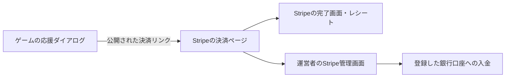

# 投げ銭機能の設計・導入手順

作成日：2026-09-06。更新：2026-09-09。ユーザーからStripe開通完了の申告を受け、本番リンク3金額を作成して受付設定を有効化。住所・電話は個別請求時に開示する方針を確認済み。[実装・有効化手順](tipping-implementation.md)。以下は当初の設計検討記録を含む。

## 1. 前提と推奨案

受取先はユーザー回答により**個人・個人事業主**。日本で事業を行い、日本円で受け取る想定。プレイヤーが、このゲームを提供する運営者へ単発で応援する。プレイヤー間送金や対局者への分配は対象外。

最初は **Stripe Payment Linksへの外部リンク**を推奨する。ただし、下記の事業内容で利用できることを確認してから採用する。登録・審査で利用不可の場合、呼び名だけを変えて開始せず、別サービスの条件を調べ直す。

日本のStripeは個人への寄付をサポートしておらず、チップは提供済みの商品・サービスに対するものという条件がある。このゲームへの任意支払いが許容されるかは未確認。「応援」「チップ」という表示だけで条件を満たすわけではない。[Stripeのチップ・寄付要件](https://support.stripe.com/questions/requirements-for-accepting-tips-or-donations?locale=ja-JP)

方針案：

- ゲームは無料で遊べる。支払いによる強さ・AI・舞台の差は設けない。
- ボタン名は「ゲームを応援する」。単発であることと、支払いが任意であることを明示する。
- 初期金額は300円・500円・1,000円の3種類。最初から選択済みにはしない。
- 月額支援、支援者名の公開、支援総額、限定スキンは次段階。初期版は個人情報と購入権限の管理を増やさない。
- 資金用途は開発・素材制作・運営。未完成機能の納期や実現を購入者に約束しない。

## 2. サービスの比較

| 方式 | 導入と運用 | 判断 |
| --- | --- | --- |
| Stripe Payment Links | Stripeアカウントと決済リンク。決済・レシート・返金を管理画面へ集約 | 条件確認を前提に第一候補 |
| Ko-fi | Ko-fiに加えStripeまたはPayPalの接続が必要。外部の支援ページを利用 | 海外向けの活動ページも欲しい場合の候補 |
| Stripe Checkout＋自前API | サーバー、秘密鍵、Webhook、支払い記録、監視が必要 | 支援者特典などを導入する時点で検討 |

Ko-fiの単発チップはFree設定でプラットフォーム手数料0%。Contributor設定等では料金が異なり、決済事業者の手数料は別途発生する。日本の受取条件も確認が必要で、Stripe側の制限を回避する手段としては扱わない。[Ko-fi料金](https://help.ko-fi.com/hc/en-us/articles/360002506494-Does-Ko-fi-take-a-fee)、[受取方法](https://help.ko-fi.com/hc/en-us/articles/115003980093-How-do-I-get-paid)

Stripeの標準カード決済料金は3.6%、標準プランの初期・月額料金は0円。以下はこの料率だけで計算した概算で、税務上の利益ではない。追加サービス、通貨換算、返金・不審請求等の条件は契約時に確認する。[公式料金](https://stripe.com/jp/pricing)

| 支払額 | 決済手数料の概算 | 差引額の概算 |
| --- | ---: | ---: |
| 300円 | 10.8円 | 289.2円 |
| 500円 | 18円 | 482円 |
| 1,000円 | 36円 | 964円 |

## 3. 画面と利用の流れ

2026-09-06のユーザー指定により、**各対局が終わったら応援モーダルを自動表示する**。手動対局・対AI・両軍AIの観戦を対象とし、1対局につき自動表示は1回。設定ダイアログと終局後の戦況パネルにも「ゲームを応援する」を残し、手動で再表示できる。

1. 終局を検出し、最後の戦闘と勝敗演出が終わった後に応援ダイアログを開く。演出OFFでは結果を約1.5秒表示してから開く。設定のリンクからも開ける。
2. 趣旨・単発支払い・金額・問い合わせ・各規約へのリンクを表示する。
3. 金額を選択して「500円で応援する（決済ページへ）」などのボタンを押す。
4. Stripeの決済ページを別タブで開く。元の対局を残す。
5. 支払い結果とレシートはStripe側で確認する。完了画面にはゲームへのリンクを設定する。

ダイアログの文言案：

> 対局おつかれさまでした！
> 将棋バトルを楽しんでいただけたら、投げ銭で開発を応援してもらえるとうれしいです。
> お支払いは今回限りです。応援の有無にかかわらず、すべてのゲーム機能を利用できます。

金額選択の下に「500円で応援する（決済ページへ）」などのボタンと「今回は閉じる」を表示する。閉じた後は終局後の盤面へ戻り、既存の「最初から」で次の対局へ進める。勝敗を隠す前に結果を見せ、支払いを次の対局の条件にしない。

### 自動表示の状態管理

- 対局開始時に`matchId`を作成し、対局保存データに保持する。新規対局・舞台変更を伴う新規対局で更新し、一手戻しでは更新しない。
- 対象は`match.end`が未終局から終局へ変化した時。詰み、AI投了、千日手、合法手なしを含む。AIエラー、AI停止、ページ離脱、途中リセットは含めない。
- 終局を検出したら表示待ちにする。最後の戦闘アニメーションと勝敗演出の終了を待つ。既存の「詰み→凱歌」は演出だけで約10.1秒かかるため、異常時の待機上限は着手アニメーションも含めて16秒にする。その時点で同じ対局が終局状態かを再確認する。
- 設定・リセット確認などの別モーダルが開いていれば閉じるまで待つ。バックグラウンドタブでは前面復帰まで待ち、モーダルを重ねない。
- 表示済みの`matchId`を、ダイアログを実際に表示する時に保存する。閉じる・言語変更・再描画・一手戻しからの再終局では自動再表示しない。これは支払済み情報ではない。
- 保存済みの終局局面をロードしただけでは自動表示しない。旧形式の保存データにも適用し、再訪時の突然の勧誘を防ぐ。
- 表示待ちの間に一手戻し、新規対局、舞台変更が発生したら待機を破棄する。古いタイマーが新しい対局で開かないよう`matchId`を照合する。
- localStorageへ保存できない場合はメモリで同一ページ内の重複を防ぐ。終局局面ロード時には表示しないため、再読込でも再表示しない。
- 本番決済リンクと必要な開示ページが未準備の間は機能フラグをOFFにし、自動表示を公開しない。

実装仕様：

- 閉じるボタン、Esc、フォーカス復帰、スマホでの表示、既存の日英切替に対応する。
- モーダルの開閉で対局をリセットしない。AIの開始・停止は既存の利用者操作を維持する。
- 外部遷移はユーザー操作による通常のリンクとし、`target="_blank" rel="noopener noreferrer"`を使う。
- ブラウザから元タブへの決済完了通知を期待しない。
- キャンセル、通信失敗、リンク無効時にもゲームは継続利用できる。
- URLが未設定なら決済ボタンを有効にしない。本番公開前にすべてのリンクを検査する。

Payment Linksは金額自由入力にも対応する。後から追加するなら推奨500円・最低300円・上限3,000円を提案する。制限はStripe側にも設定し、ゲーム側の表示だけに依存しない。[Payment Links作成仕様](https://docs.stripe.com/payment-links/create)

## 4. 現在のアプリに合わせた技術設計

本リポジトリは`dist/`内のHTML・JavaScriptを直接配信する構成。対局状態はlocalStorageに保存し、決済用サーバーや会員DBは存在しない。現在の本番URLは`https://shogi-battle.com/`で、AWSのS3＋CloudFrontから配信する。既存Sitesへの紐付けも残っているが、今回の公開更新は[現在のAWS配信手順](aws-deployment.md)に従う。

初期版ではAPI・DB・Webhook・Stripe SDKを追加しない。ゲームに保存するのは公開用Payment Link URLと表示設定だけ。カード番号、メールアドレス、決済履歴をゲーム側では収集しない。秘密鍵や銀行情報をソースに置く必要はない。

AI用のCOOP/COEPはAWS本番ではCloudFrontのレスポンスヘッダーポリシーが設定する（Sites等の静的ホスト向けには`dist/_headers`もある）。外部決済フォームの埋め込みやポップアップ連携は避け、独立した外部ページに移動する。AIのためのヘッダーを緩めない。

実装箇所（初期の変更予定から、既存HTMLを大きく変更せずモジュール側でUIを追加する形へ変更）：

| ファイル | 内容 |
| --- | --- |
| `dist/app.js` | 開閉とフォーカス管理、終局時の表示条件 |
| 対局保存処理 | `matchId`と応援モーダル表示済み状態、旧保存データとの互換処理 |
| `dist/support-config.mjs`（新規） | 有効フラグ、金額ごとの公開URL |
| `dist/support.mjs`（新規） | ダイアログと導線の追加、金額選択、決済リンク表示、日英切替 |
| `dist/support-prompt.mjs`（新規） | 終局遷移、表示待ち、対局ごとの重複防止 |
| `dist/style.css` | 既存UIに合わせた表示 |
| `dist/legal.html`（新規） | 商取引に関する開示 |
| `dist/privacy.html`（新規） | 個人情報・決済事業者の説明 |
| `dist/support-terms.html`（新規） | 単発支払い、特典、返金、連絡先 |

支払成功の判定はStripe管理画面を正とする。戻り先URLやlocalStorageのフラグから「支払済み」を認定しない。これらを根拠に支援者バッジや特典を付与しない。初期版ではゲーム内の支払成功画面自体を設けない。

## 5. 登録・準備の段取り

| 順序 | 担当 | 作業・完了条件 |
| --- | --- | --- |
| 1 | 運営者 | 受取名義・活動名・連絡先・日本での事業情報を整理 |
| 2 | 開発側＋運営者 | ゲーム説明、応援の趣旨、開示・プライバシー・返金の文案を作成。本人情報を確定し、審査担当者が見られる公開URLを用意 |
| 3 | 運営者 | Stripe登録、二要素認証、事業内容の確認依頼。必要に応じて手順2と並行 |
| 4 | 運営者 | 本人確認・銀行口座登録・必要な追加情報提出。決済と入金の有効化状況を確認 |
| 5 | 開発側 | テスト環境のリンクでUIを実装・検証 |
| 6 | 運営者＋開発側 | 事業条件と審査結果を確認し、本番リンク・レシート・問い合わせ・表示情報を最終確認 |
| 7 | 開発側 | 本番URLへ切替、AWSへ公開、公開先で導線とAIを確認 |
| 8 | 運営者 | 利用開始後の実取引・初回入金を管理画面で照合 |

登録時に用意する情報は、本人氏名・住所・生年月日等の求められた本人情報、活動内容、公開サイト、問い合わせ先、受取銀行口座、本人確認書類。要求項目は申請画面に従う。本人情報と口座情報は運営者がサービスへ直接入力する。[日本向け開始ガイド](https://support.stripe.com/questions/getting-started-with-stripe-a-guide-for-users-in-japan?locale=ja-JP)

新規登録はまずStripeのみで足りる。ゲーム内ログインサービスやDB契約は不要。専用ドメインは必須にせず、公開URLを継続利用できることを確認する。問い合わせ用メールアドレスは用意する。

### Stripeへの確認文案（未送信）

> 日本在住の個人／個人事業主として、無料のブラウザ将棋ゲーム「AETHER SHOGI（将棋バトル）」を提供しています。公開URL：https://shogi-battle.com/ 。
> 提供済みのゲームを遊んだ利用者から、運営者本人に対して300円・500円・1,000円の任意の単発チップを受け取ることを検討しています。
> 支払いはゲーム利用の条件ではなく、機能の解放や物品提供はありません。慈善寄付、第三者への送金、プレイヤーへの分配、賭け金・賞金には利用しません。
> このモデルを日本の個人／個人事業主アカウントでPayment Linksにより取り扱えますか。必要な表示、事業区分、追加審査があれば教えてください。

### 個人情報の公開範囲

Stripeは日本の加盟店に商取引の開示ページを求めている。運営名義、連絡先、支払金額・時期・方法、追加費用、提供内容、返金条件などをこのサービスに合わせて記載する。住所等について個人事業主向けの「請求時に開示」という扱いも案内されているため、実際に採用できる項目・条件を確認する。屋号だけで完全匿名にできるとは想定しない。[Stripeの開示ガイド](https://support.stripe.com/questions/how-to-create-and-display-a-commerce-disclosure-page?locale=ja-JP)

決済画面、レシート、カード明細、開示ページのそれぞれで何が見えるか確認してから公開する。未確定の氏名・住所を仮情報で公開しない。

## 6. 返金・会計・保守

返金方針案は「誤操作・重複支払いは問い合わせ窓口で確認し、必要な返金は元の決済へ返す」。受付期限等は運営者と確定して画面に明示する。問い合わせには決済日時・金額・レシートの識別情報を使い、カード番号を送らせない。

日常運用はStripeの決済・不審請求・入金失敗の通知を確認し、問い合わせに対応する。月次で支払総額、決済手数料、返金、差引入金と銀行記録を照合する。税務上の扱いは「投げ銭」という名称だけで決めず、実態に沿って税理士等に確認する。

停止時はStripeのリンクを無効化し、ゲームの応援導線も無効化して公開する。古いサイトやキャッシュからリンクへアクセスされてもStripe側で受け付けを止められる構成とする。

## 7. 検証と公開条件

- テスト環境でカード決済成功・失敗・本人認証・キャンセルを確認する。実カードを用いた自己決済によるテストは予定しない。
- 選択金額と遷移先の金額が一致し、単発支払いになっている。
- テストURLと本番URLを取り違えていない。無効・未設定リンクを案内しない。
- 支払いの前後で盤面、棋譜、AI操作が壊れない。スマホで元のゲームへ戻れる。
- 手動・対AI・両軍AIの各終局で演出後に1回だけ表示する。詰み・投了・千日手・合法手なしを確認する。
- 再描画、言語変更、再読込、一手戻しからの再終局では重複表示しない。新しい対局の終局では表示する。
- 別モーダル表示中、バックグラウンド、演出完了通知の欠落、待機中のリセット、保存失敗でも状態が破綻しない。
- 英語、キーボード、Esc、フォーカス復帰、画面幅を確認する。
- 開示ページ・規約・連絡先へ決済前にアクセスできる。
- 決済結果はStripe側で確認でき、レシート設定を検証済み。
- 公開URLで決済導線とAIのクロスオリジン分離が機能する。

実装の検証結果と、本番Stripeを使う確認の未完了項目は[実装・有効化手順](tipping-implementation.md)に記載する。

## 8. 工数の目安と拡張条件

初期版の実作業は、文面・設定整理0.5〜1日、UI実装0.5〜1日、決済・公開検証0.5〜1日の**計1.5〜3人日程度**を見込む。本人確認、事業確認、審査、運営者の情報準備に要する待ち時間は別で、公開日はその結果に依存する。

支援者バッジ、限定スキン、累計額表示を追加する場合は、決済とユーザーを結びつける認証・サーバー・DBが必要になる。Webhook署名検証、イベントの重複処理防止、金額と通貨の検証、返金・不審請求時の権限更新まで設計してから着手する。月額支援には解約導線も追加する。

## 9. Stripe登録後の設定メモ

2026-09-06、ユーザーから登録完了の連絡。本番ダッシュボードの名称は「Shogi-battle」。決済リンクはまだ作られていない。その後、任意チップに関する問い合わせをユーザーが送信済み。現在は回答待ち。アカウントの入金可否や追加審査の完了まで確認したものではない。

本番リンク作成前の設定案：

| 項目 | 内容 |
| --- | --- |
| 商品名 | 将棋バトルへの応援（単発チップ） |
| 説明 | 提供中の無料ブラウザ将棋ゲームへの任意の応援です。今回限りのお支払いで、支援による機能差や追加特典はありません。 |
| 価格 | 300円・500円・1,000円。各価格について単発のリンクを作る |
| 数量変更 | 無効 |
| 支払完了 | Stripeの完了画面でお礼を表示し、ゲームへ戻るリンクを用意 |
| 追加サービス | 作成画面のManaged PaymentsはOFFだった。必要性を確認するまで有効にしない |
| 税金 | 作成画面の「税金を自動徴収」がONだった。課税区分と税込・税別を確定し、案内金額と請求総額を照合する。税務上の根拠なくOFFにはしない |

次の着手点は、**任意チップの利用可否の確認状況を確かめ、開示情報と税の設定を確定すること**。その間にUIと開示文面の下書きは進められる。
